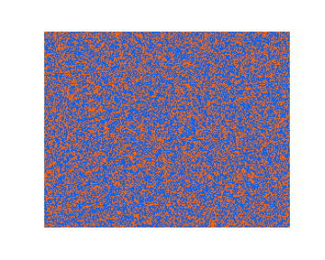

# master-thesis
In this repository you will find the experiment, scripts, raw data as well as most graphs related to my master thesis which was supervised by [@LuSchumacher](https://github.com/LuSchumacher) and [@mschnuerch](https://github.com/mschnuerch).
If you want to run this code on your machine, keep in mind that your c++ toolchain needs to be configured so that RStan can be used. More info can be found [here](https://github.com/stan-dev/rstan/wiki/RStan-Getting-Started). To run the experiment you will need Opensesame which can be found [here](https://osdoc.cogsci.nl/3.3/).

If you have any questions, need help running the scripts or want to fix a mistake don't hesitate to open a pull request or contact me via steffen.e1996 at gmail.com.

## Summary

The goal of the thesis was to validate a superstatistical model which describes a local model and how it changes over time, described in a higher level transition model. The local model is called the drift diffusion Model (DDM) by Ratcliff (1978) and describes the way we make binary and fast decisions. An example of such binary and quick decisions is whether the following picture has more orange or blue pixels. These cognitive models were estimated using the [Bayesflow](https://bayesflow.org/index.html) approach (Radev et al., 2023) and succesfully validated.

## The drift diffusion model

The DDM presupposes a noisy accumulation of evidence for and against the possible answers until one of two thresholds is met and a decision is made.
The starting point z describes a possible bias. If it is not centered exactly between either thresholds, then less evidence is needed for one of the decisions.
The distance aXX between the two thresholds describes how much evidence is needed before a decision is made. It is a measure of conservativeness.
The drift rate vXX is the systematic drift of the accumulation curve in a particular direction.
Lastly, the non-decision-time τXX encompasses all non-decisional processes such as motor activity (pressing a button). τXX is not depicted in this visualization of the DDM.

## Cognition as a dynamic system

Cognition is inherently dynamic, e.g. short-term visual memory changes during our whole lifetime (Brockmole & Logie, 2013) but there are also many changes during a very short timeframe (Riley & Holden, 2012). This is a problem because traditional estimation methods necessitate independent and identically distributed data (IID), which leads to a static model of human cognition with no or inaccurate changes over time. To capture these short-term changes, one needs to estimate a new model for every trial (decision) based on all previous data. Such a model with so-called bayesian updating is computationally intensive and not necessarily accurate (Schumacher, 2023).

## BayesFlow
To address these challenges the [Bayesflow](https://bayesflow.org/index.html) approach (Radev et al., 2023) can be used. It takes advantage of training multiple neural networks which are trained on simulated data to accurately summarize the data and estimate parameters based on that summary. In exchange for this computationally expensive training phase, the estimation of the model can be done extremely quickly. With this optimization we can map temporal changes over time with little computational expenditure.

## Goal & result of my thesis
This BayesFlow approach was already successfully implemented for the DDM. The goal of my thesis was to further validate it in a new experiment where I aimed to manipulate *v* and *a*. To target *v*, I varied the difficulty by changing the ratio between blue and orange pixels and to target *a*, participants had blocks of trials with different instructions and rewards, penalizing either being both too slow and inaccurate or only being inaccurate.

To validate whether the dynamic approach successfully captured these changes of the model parameters we computed static models. An exemplary comparison is seen here. The red lines are the dynamic estimations and the grey lines the static estimates. 

To further test whether the parameter estimations are plausible, the original datapoints were estimated from the parameters. This graph shows the simulated and original reaction times over all participants. It is apparent that the median estimate of the dynamic model (red dots) closely follows the empirical estimates.

## bibliography 
Brockmole, J. R. & Logie, R. H. (2013). Age-Related change in visual working memory: a study of 55,753 participants aged 8–75. Frontiers in Psychology, 4. https://doi.org/10.3389/fpsyg.2013.00012

Radev, S. T., Schmitt, M., Schumacher, L., Elsemüller, L., Pratz, V., Schälte, Y., Köthe, U. & Bürkner, P. (2023). BayesFlow: Amortized Bayesian workflows with neural networks. arXiv (Cornell University). https://doi.org/10.48550/arxiv.2306.16015

Ratcliff, R. (1978). A theory of memory retrieval. Psychological Review, 85(2), 59–108. https://doi.org/10.1037/0033-295x.85.2.59

Riley, M. A. & Holden, J. G. (2012). Dynamics of cognition. Wiley Interdisciplinary Reviews: Cognitive Science, 3(6), 593–606. https://doi.org/10.1002/wcs.1200

Schumacher, L., Bürkner, P., Voß, A., Köthe, U. & Radev, S. T. (2023). Neural Superstatistics for Bayesian estimation of dynamic cognitive models. Scientific Reports, 13(1). https://doi.org/10.1038/s41598-023-40278-3
